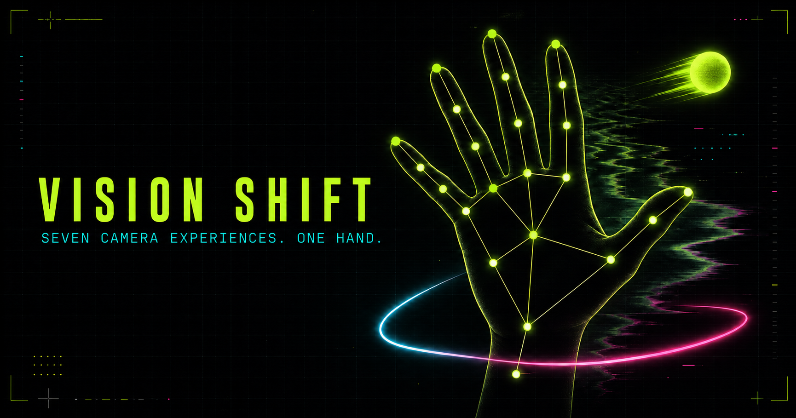

# VisionShift



VisionShift is a browser-based computer-vision playground with six live camera experiences controlled by one hand. A shared MediaPipe pipeline recognizes gestures and tracks 21 hand landmarks locally in the browser; camera frames are not uploaded by this project.

> **Working with the team?** Read and update [TEAM_WORK.md](./TEAM_WORK.md) before editing. It records active ownership, branches, handoffs, and completed work so contributors do not unknowingly change the same files.

## Experiences and controls

### 01 · Reality FX

| Control | Result |
| --- | --- |
| Open palm | Activate the background-reference invisibility cloak |
| Closed fist | Split the camera into an RGB glitch |
| Victory sign | Leave multi-frame ghost echoes |
| Point upward | Return to the normal camera |

For the cleanest cloak, keep the camera fixed, step fully out of frame, capture the empty background, and then return. The effect inserts that clean reference only where person segmentation detects you.

### 02 · Air Canvas

| Control | Result |
| --- | --- |
| Pinch thumb and index finger, then move | Draw with the index fingertip |
| Open palm | Erase beneath the index fingertip |
| Victory sign | Cycle through the ink palette |
| Hold a closed fist | Clear the canvas |

### 03 · Hand HUD

Show one hand to inspect all 21 tracked landmarks, their connection graph, fingertip positions, handedness, gesture label, and recognition confidence in real time.

### 04 · Orb Game

Aim with the index fingertip and pinch while it overlaps the glowing orb. Consecutive hits build a streak and raise the score. Hold a closed fist to reset the run.

### 05 · Sign Lab

Match a short lesson of five static ASL handshapes: **B**, **I**, **L**, **Y**, and **I love you**. Hold each target steadily until its progress bar completes.

Sign Lab is a small handshape-practice experiment. It is **not** a sign-language translator, interpreter, accessibility tool, or substitute for learning from Deaf signers and qualified teachers. As the [NIDCD overview of American Sign Language](https://www.nidcd.nih.gov/health/american-sign-language) explains, ASL is a complete natural language with its own grammar; motion, orientation, location, facial expression, and two-handed forms are outside this simplified classifier's scope.

### 06 · Neon Pong

Move your hand vertically to control the neon paddle and return the ball. Each hit raises the score and gradually increases the pace; a miss costs a life. Hold a closed fist to restart the game.

## Run locally

Requirements: a modern Chromium-based browser, a webcam, Python 3 for the bundled static server, and a current Node.js/npm installation for dependencies and tests.

### macOS — recommended

Double-click **START VISION SHIFT.command** in the project folder. The launcher installs the browser runtime when needed, reuses an existing VisionShift server or selects an available local port from `8080` through `8099`, and opens the correct page automatically.

If macOS blocks the launcher the first time, right-click **START VISION SHIFT.command**, choose **Open**, and confirm.

### Terminal

```bash
npm install
npm start
```

Open [http://localhost:8080](http://localhost:8080), select an experience, choose **Enable camera**, and allow camera access.

**Do not double-click `index.html`.** A `file:///...` page cannot load the camera modules correctly because browser module and camera security rules require localhost or HTTPS. If it is opened accidentally, VisionShift shows the exact launcher instructions. It also checks local ports `8080`–`8099` for VisionShift's health marker and redirects automatically when the app is already running.

If a model or application module fails to load, the dependency-free page shell and experience navigation remain available. Follow the on-screen restart message, close the stale tab if necessary, and open **START VISION SHIFT.command** again.

## Test and build

```bash
npm test
npm run build
npm run preview
```

`npm run build` creates a self-contained static deployment in `dist/`. It includes the application modules, local MediaPipe models, and the MediaPipe Tasks Vision browser runtime. Preview that exact build at [http://localhost:8081](http://localhost:8081).

## Deploy with GitHub Pages

The included GitHub Actions workflow tests, builds, and deploys the site whenever `main` is pushed:

1. Push the project to the repository's `main` branch.
2. Open **Settings → Pages** in GitHub.
3. Under **Build and deployment**, set **Source** to **GitHub Actions**.
4. Push another commit or manually run the Pages workflow from the **Actions** tab.

The deployed site must use HTTPS for webcam access; GitHub Pages provides HTTPS. If a deployment fails, check the workflow log first and verify that GitHub Pages is enabled for the repository.

## Architecture

```text
Webcam frame
    │
    ├── MediaPipe Gesture Recognizer
    │       ├── gesture + confidence
    │       ├── handedness
    │       └── 21 normalized hand landmarks
    │
    ├── MediaPipe Image Segmenter (Reality FX cloak)
    │
    └── Experience router
            ├── Reality FX  → segmentation + Canvas compositing
            ├── Air Canvas  → pinch geometry + persistent ink layer
            ├── Hand HUD    → landmark connection renderer
            ├── Orb Game    → fingertip collision + pinch state
            ├── Sign Lab    → finger-state patterns + hold progress
            └── Neon Pong   → palm-driven paddle + ball physics
```

One recognition result is shared across all experiences, so switching modules does not load another hand model. Rendering and interaction happen with Canvas 2D and vanilla JavaScript modules.

See [PROJECT_GUIDE.md](./PROJECT_GUIDE.md) for the internal state, module logic, and file map.

## Privacy and limitations

- Camera processing happens in the browser. This project's code does not record, store, or upload camera frames.
- Models and runtime assets are served with the static site, so no backend or API key is required.
- Recognition quality depends on lighting, hand visibility, camera angle, motion blur, and device performance.
- The app tracks one hand. Gestures that overlap the face/body or leave the frame may be missed.
- The cloak cannot reconstruct what the camera never saw; it uses a previously captured empty-scene reference and works best with a stationary camera and steady lighting.
- Sign Lab recognizes only five simplified, static finger-state patterns and has the important language/accessibility limitations described above.
- Webcam access is available only on secure origins (HTTPS) or localhost.

## Technology

- [MediaPipe Tasks Vision](https://ai.google.dev/edge/mediapipe/solutions/vision/gesture_recognizer/web_js)
- Canvas 2D compositing and game rendering
- Native browser `getUserMedia`
- Vanilla JavaScript modules
- Node's built-in test runner
- [GitHub Actions and GitHub Pages](https://docs.github.com/en/pages/getting-started-with-github-pages/using-custom-workflows-with-github-pages)
